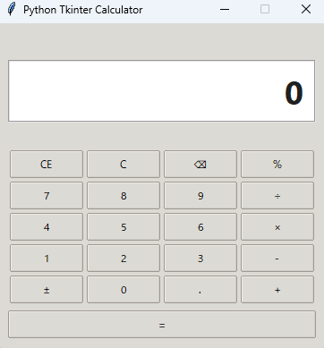

# Calculator (Tkinter)

## 概要
Python 3.12 以降と Tkinter で構築したデスクトップ電卓アプリです。安全な AST ベース評価で四則演算やパーセント計算をサポートします。

## 機能
- 四則演算（+ / - / × / ÷）
- 小数入力、パーセント、符号切替(±)
- C / CE / バックスペース
- キーボードショートカット対応
- ゼロ除算などのエラー表示
- PyInstaller による配布用ビルド

## スクリーンショット


## キーボード操作
| キー | 動作 |
| ---- | ---- |
| 0-9 / . | 数値入力 |
| Enter / Num Enter | 計算実行 (=) |
| + / - / * / / | 各演算子 |
| Backspace | バックスペース |
| Delete | CE |
| Esc | C |
| F9 | ± |
| % | パーセント |

## インストール
```powershell
uv sync
```
`uv` で依存関係をインストールします。
```powershell
python -m venv .venv
.\.venv\Scripts\Activate.ps1
python -m pip install -e .[dev]
```
`uv` がない場合の代替手順です。

## 使い方
```powershell
uv run python -m calc.app
```
GUI アプリを起動します。

## 開発
```powershell
uv run black src tests
uv run ruff check src tests
uv run pytest -q
```
フォーマット・Lint・テストの実行例です。

## ビルド
```powershell
uv run pyinstaller --onefile --windowed --name Calculator src/calc/app.py
```
配布用の単一実行ファイルを作成します。

## ライセンス
このプロジェクトは [MIT License](LICENSE) の下で提供されます。
